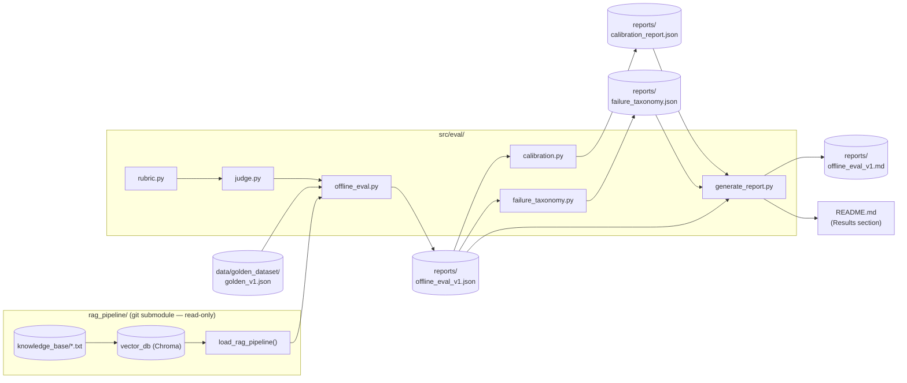
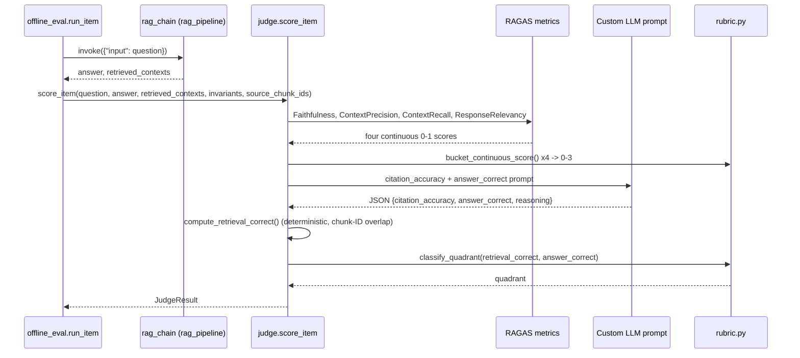
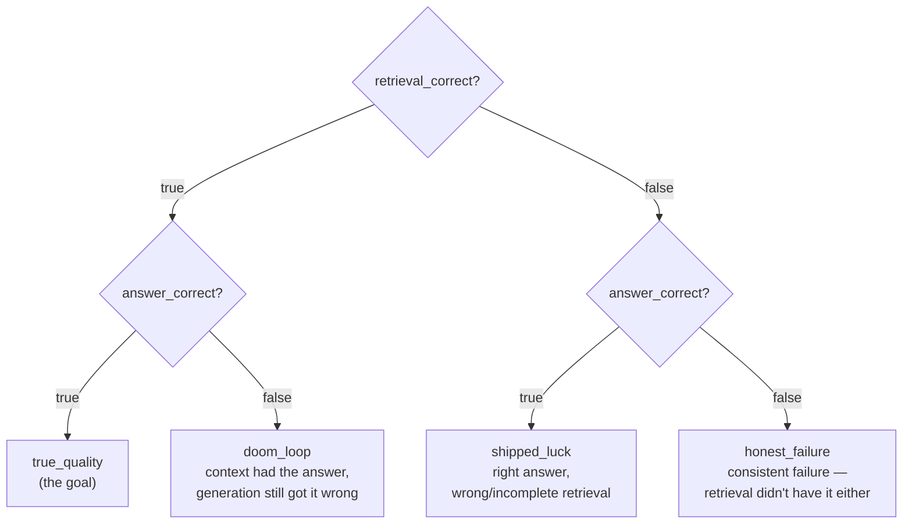
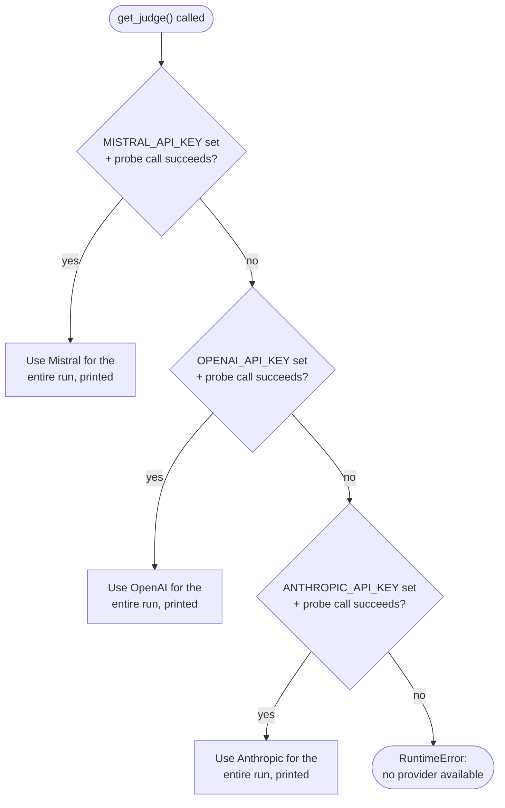
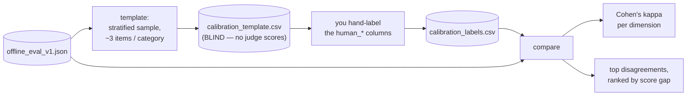
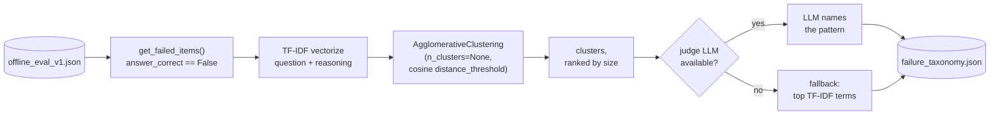

# RAG Evaluation Framework

A companion evaluation framework for
[RAG_LangChain_Demo](https://github.com/Charu1806/RAG_LangChain_Demo) — the
AcmeTech RAG demo (LangChain + ChromaDB + Mistral).

This repo does not reimplement or modify that system. It measures it:
retrieval quality, answer quality, and failure modes, scored against a
hand-built golden dataset instead of spot-checked by eye.

Full spec: [PRD.md](PRD.md). Currently implemented: **Part 1** (golden
dataset, offline eval, judge, calibration, failure taxonomy). Part 2
(traffic simulation) and Part 3 (closing the loop) are documented in the PRD
but not yet built.

## Setup

```bash
git clone --recurse-submodules https://github.com/Charu1806/RAG_Eval_Framework.git
cd RAG_Eval_Framework

# this repo's eval dependencies
pip install -r requirements.txt

# the RAG pipeline being evaluated (separate dependency set)
pip install -r rag_pipeline/config/requirements.txt
```

If you already cloned without `--recurse-submodules`:

```bash
git submodule update --init --recursive
```

The RAG pipeline requires `MISTRAL_API_KEY` to be set — see
[rag_pipeline/README.md](rag_pipeline/README.md) for how to get one. The
judge (see below) additionally falls back to `OPENAI_API_KEY` /
`ANTHROPIC_API_KEY` if Mistral is unavailable, but needs none of those set
beyond Mistral to run.

## Running the pipeline

In order, from the repo root:

```bash
python -m src.eval.offline_eval                 # scores the golden dataset -> reports/offline_eval_v1.json
python -m src.eval.calibration template          # -> reports/calibration_template.csv (blind)
#   ... hand-label the human_* columns, save as reports/calibration_labels.csv ...
python -m src.eval.calibration compare           # -> reports/calibration_report.json
python -m src.eval.failure_taxonomy              # -> reports/failure_taxonomy.json
python -m src.eval.generate_report               # -> reports/offline_eval_v1.md + updates this README
```

Useful flags: `offline_eval.py --limit 5` for a quick smoke test,
`--judge-provider {mistral,openai,anthropic}` to force a specific judge on
`offline_eval.py` / `failure_taxonomy.py`, `failure_taxonomy.py
--no-llm-labels` to cluster without any API calls.

## Libraries & tools

What's actually wired into the code below, why it's there, and what else
was considered. Two entries in `requirements.txt` (`pandas`, `deepeval`)
are **not** currently imported anywhere in `src/eval/` — listed honestly as
such rather than pretending they're load-bearing.

| Tool | Type | Used for | Alternatives |
|---|---|---|---|
| **RAGAS** (`ragas`) | RAG eval framework | 4 of the 5 rubric dimensions in `judge.py` — `Faithfulness`, `LLMContextPrecisionWithoutReference`, `LLMContextRecall`, `ResponseRelevancy`. Each metric internally prompts an LLM (see below) and returns a continuous 0–1 score, bucketed onto the 0–3 rubric scale | **DeepEval** (installed, unused — see below), **TruLens**, **LangSmith Evaluators**, or hand-rolled LLM-as-judge prompts for every dimension instead of RAGAS's pre-built ones (more control, a lot more prompt-writing) |
| **DeepEval** (`deepeval`) | RAG eval framework | Nothing yet — it's in `requirements.txt` from the original scope ("ragas, deepeval, standard data libs") but RAGAS's metric set mapped more directly onto the PRD's 5 rubric dimensions, so it was never wired in. Kept installed as a documented, ready-to-try alternative to RAGAS (pytest-style API, overlapping metric set) without adding a new dependency later | RAGAS (what's actually used) |
| **Mistral** (`langchain-mistralai`, model `mistral-large-latest`) | LLM judge, default | First provider tried in `judge.get_judge()`'s fallback chain. Chosen as default because it's the same provider `rag_pipeline` already uses to *generate* answers — one fewer API key to manage. (Using the same model family to both generate and judge is a known bias risk, which is exactly why there's a fallback chain to a different family rather than only ever using Mistral) | **OpenAI**, **Anthropic** (both below), **Google Gemini**, or a **local judge via Ollama** (the PRD's own suggested mitigation for judge cost/latency at scale — not implemented; would need a `langchain-ollama` wrapper added to `_build_chat_model()`) |
| **OpenAI** (`langchain-openai`, model `gpt-4o-mini`) | LLM judge, fallback #2 | Used only if Mistral's key is missing or its probe call fails. Different model family than the system under test, so it avoids the same-model-bias risk noted above; cheap | Any other OpenAI chat model (`gpt-4o`, etc.) via the same wrapper |
| **Anthropic** (`langchain-anthropic`, model `claude-3-5-sonnet-latest`) | LLM judge, fallback #3 | Last resort if both Mistral and OpenAI are unavailable. Strongest reasoning of the three, also the priciest, which is why it's last in the chain rather than first | Any other Claude model via the same wrapper |
| **LangChain core** (`langchain-core`) | Abstraction layer | Common `BaseChatModel` / `Embeddings` interfaces so `judge.py` can treat Mistral/OpenAI/Anthropic/HuggingFace interchangeably, and so RAGAS's `LangchainLLMWrapper` / `LangchainEmbeddingsWrapper` can adapt any of them into RAGAS's own metric interface | Call each provider's raw SDK directly (`openai`, `anthropic`, `mistralai` packages) — less abstraction and boilerplate per provider, but no shared interface, and RAGAS would need its own per-provider glue instead of one wrapper |
| **HuggingFace embeddings** (`langchain-huggingface` + `sentence-transformers`, model `all-MiniLM-L6-v2`) | Local embedding model | Same model `rag_pipeline` uses for retrieval, reused by RAGAS's `ResponseRelevancy` metric (which embeds a synthetic question generated from the answer and compares it back to the original question). Runs locally, no API key or network call at eval time (aside from the one-time model download) | OpenAI/Cohere embeddings API (paid, network-dependent, often higher quality), or a larger local sentence-transformers model (e.g. `all-mpnet-base-v2` — slower, more accurate) |
| **scikit-learn** (`scikit-learn`) | ML utilities | Two unrelated uses: `cohen_kappa_score` in `calibration.py` (standard Cohen's kappa implementation), and `TfidfVectorizer` + `AgglomerativeClustering` in `failure_taxonomy.py` (bottom-up clustering with no fixed number of clusters) | For kappa: hand-roll the formula (it's simple) or use `statsmodels`. For clustering: **HDBSCAN** (also density-based, no fixed k, needs a separate `hdbscan` package) or call `scipy.cluster.hierarchy` directly (same underlying algorithm as `AgglomerativeClustering`, lower-level API) |
| **NumPy** (`numpy`) | Array math | TF-IDF cluster-centroid math in `failure_taxonomy.py`'s `top_terms()` | None realistic at this scale — it's the standard |
| **pandas** (`pandas`) | *(not currently used)* | Nothing yet. Listed in `requirements.txt` per the original "standard data libs" scope; `calibration.py`'s CSV read/write turned out simple enough to use the stdlib `csv` module instead of a DataFrame. Left installed since it's a near-certain dependency once Part 2/3 (traffic simulation, online eval) or ad-hoc analysis notebooks get built | stdlib `csv` (what's actually used) |

Separately — `rag_pipeline/` (the system *under test*, not part of this
repo's own stack) uses **Chroma** (`langchain-chroma`, `chromadb`) as its
vector store and **Mistral** (`mistral-small-latest`) as its generator
model; its own `config/requirements.txt` also lists **FAISS** as an
alternative vector store it doesn't currently use.

## Architecture



`rag_pipeline/` is never modified or duplicated — everything here imports
`load_rag_pipeline()` from it and treats it as a black box under test.

## How one golden item gets scored



---

## Module reference

### `src/eval/rubric.py` — scoring definitions

Pure Python, no dependencies. The single source of truth for what each
score level means — both `judge.py`'s prompts and `calibration.py`'s
cheat-sheet are generated from this file, so the judge and a human labeler
are always grading against the same definitions.



| Symbol | Kind | Description |
|---|---|---|
| `Dimension` | Enum | The 5 rubric dimensions: `faithfulness`, `context_precision`, `context_recall`, `answer_relevancy`, `citation_accuracy` |
| `Quadrant` | Enum | The 4 classification labels: `true_quality`, `shipped_luck`, `doom_loop`, `honest_failure` |
| `RUBRIC` | dict constant | `Dimension -> {0: "...", 1: "...", 2: "...", 3: "..."}` — the level definitions, independently worded per dimension |
| `level_definitions(dimension)` | function | Returns the `{level: description}` dict for one dimension |
| `bucket_continuous_score(score)` | function | Maps a RAGAS-style continuous 0–1 score onto the 0–3 scale (`<0.25→0`, `<0.5→1`, `<0.85→2`, else `3`) |
| `RubricScore` | dataclass | Holds all 5 dimension scores; validates each is 0–3 on construction; `.average()`, `.as_dict()` |
| `classify_quadrant(retrieval_correct, answer_correct)` | function | Implements the 2×2 decision tree above, returns a `Quadrant` |

### `src/eval/judge.py` — RAGAS + custom LLM-as-judge

Scores one item at a time: 4 dimensions via RAGAS (verified against the
installed 0.4.3 API), `citation_accuracy` + `answer_correct` via a custom
prompt built from `rubric.py`'s level definitions, `retrieval_correct`
computed deterministically (not LLM-judged — the golden dataset carries
objective chunk-ID ground truth, so a lookup is more reliable than a guess).



The provider is picked once per run and never swapped mid-run, so all items
in one `offline_eval_v1.json` are judged consistently.

| Symbol | Kind | Description |
|---|---|---|
| `JUDGE_PROVIDERS` | constant | `("mistral", "openai", "anthropic")` — the fallback order |
| `get_judge(preferred_provider=None)` | function | Walks the fallback chain above, returns a `Judge` bound to whichever provider actually answered a cheap probe call |
| `Judge` | dataclass | `provider`, `model_name`, `llm` (raw LangChain chat model, used for the custom prompt), `ragas_llm` (same model wrapped for RAGAS) |
| `get_raw_embeddings()` | function | Returns the unwrapped `HuggingFaceEmbeddings` (all-MiniLM-L6-v2 — the same model `rag_pipeline` uses) |
| `get_embeddings()` | function | RAGAS-wrapped version of the above, for `ResponseRelevancy` |
| `extract_chunk_ids(retrieved_contexts)` | function | Regex-extracts `Document ID: XXX-000` tokens embedded in each chunk's text |
| `compute_retrieval_correct(retrieved_contexts, golden_source_chunk_ids)` | function | True only if *every* golden source chunk ID was actually retrieved |
| `judge_citation_and_correctness(judge, question, invariants, retrieved_contexts, answer)` | function | Sends the custom prompt (built from `rubric.RUBRIC`'s citation levels), returns the parsed JSON `{answer_correct, citation_accuracy, ...reasoning}` |
| `JudgeResult` | dataclass | Full per-item result: `rubric` (`RubricScore`), `retrieval_correct`, `answer_correct`, `quadrant`, both reasoning strings, `judge_provider`/`judge_model`; `.as_dict()` |
| `score_item(judge, embeddings, *, question, answer, retrieved_contexts, invariants, golden_source_chunk_ids)` | function | Runs all 4 RAGAS metrics + the custom prompt + the deterministic retrieval check, returns one `JudgeResult` |

### `src/eval/offline_eval.py` — runs the golden set through the pipeline

Imports `load_rag_pipeline()` from the `rag_pipeline/` submodule (never
reimplemented), loops over every golden item, scores each with `judge.py`,
and writes per-item + aggregate results.

| Symbol | Kind | Description |
|---|---|---|
| `load_golden_dataset(path)` | function | Loads `data/golden_dataset/golden_v1.json` |
| `run_item(rag_chain, judge, embeddings, item)` | function | Runs one golden item through `rag_chain.invoke()`, then `judge.score_item()`; returns the full per-item record (including raw `retrieved_contexts`, used later by `calibration.py`) |
| `aggregate(results)` | function | Rubric averages (overall + per-dimension), quadrant counts, per-category and per-difficulty averages |
| `main()` | CLI | `--limit N` (smoke test), `--judge-provider`, `--output`; paces generation calls at 1.5s (matches `rag_pipeline`'s own Mistral free-tier pacing) |

### `src/eval/calibration.py` — human vs. judge agreement

Two-step, blind by design: the hand-labeling template shows the question,
answer, and retrieved context, but **not** the judge's scores, so labeling
isn't anchored on what the judge already said.



| Symbol | Kind | Description |
|---|---|---|
| `write_rubric_reference(path)` | function | Writes `calibration_rubric_reference.md`, the same level definitions given to the judge, so hand labels use identical criteria |
| `sample_items_for_calibration(offline_eval, n=18, seed=42)` | function | Stratified sample, `n / num_categories` per category, reproducible via `seed` |
| `generate_template(offline_eval_path, output_csv, n, seed)` | function | Writes the blind CSV template (`template` CLI command) |
| `compute_calibration(labels_csv, offline_eval_path, top_n_disagreements=5)` | function | Joins hand labels to judge scores by `id`; computes linear-weighted Cohen's kappa per rubric dimension and unweighted kappa for the two boolean fields; ranks disagreements by total score gap (a boolean correctness flip counts as a max-size gap) |
| `main()` | CLI | Subcommands `template` and `compare` |

### `src/eval/failure_taxonomy.py` — bottom-up clustering of failures

No predefined failure categories. TF-IDF over each failed item's question +
judge reasoning feeds agglomerative clustering with **no fixed number of
clusters** — a cosine distance threshold decides how many groups emerge, so
the taxonomy reflects whatever actually went wrong in this run.



Semantic embeddings (the same model `judge.py` uses) were tried first for
the clustering signal and dropped: on short judge-reasoning sentences,
TF-IDF's exact-phrase overlap separated two hand-checked failure themes
cleanly at `distance_threshold=0.85`, while embedding distances didn't
separate them at any threshold tested. TF-IDF also needs no model download.

| Symbol | Kind | Description |
|---|---|---|
| `get_failed_items(offline_eval)` | function | Filters to items scored `answer_correct=False` (i.e. `doom_loop` + `honest_failure`; `shipped_luck` items got the right answer this time, so aren't counted as failures) |
| `top_terms(vectorizer, X, indices, top_n=6)` | function | Descriptive top TF-IDF terms for a cluster (used in the report and as the label fallback) |
| `llm_label_cluster(judge, reasonings, max_examples=6)` | function | Asks the judge LLM to name the common failure pattern in 3–6 words from a sample of the cluster's reasoning text |
| `build_taxonomy(offline_eval, distance_threshold=0.85, use_llm_labels=True, judge=None)` | function | Runs the full pipeline above, returns `{n_total_items, n_failed, failure_rate, clusters: [...]}`, clusters sorted by size descending |
| `main()` | CLI | `--distance-threshold`, `--no-llm-labels` (skip API calls entirely), `--judge-provider` |

### `src/eval/generate_report.py` — combines everything into the report

Pure formatting — no LLM calls, no evaluation logic. Reads the three JSON
artifacts above and renders `reports/offline_eval_v1.md`, then updates this
README's Results section. Each section degrades gracefully with a "not run
yet" note if `calibration_report.json` / `failure_taxonomy.json` don't
exist, so the report can be regenerated after any single stage.

| Symbol | Kind | Description |
|---|---|---|
| `render_rubric_table(aggregate)` | function | Per-dimension + overall average table |
| `render_quadrant_table(aggregate)` | function | 2×2 quadrant counts + percentages |
| `render_category_table(aggregate)` | function | Average rubric score per category |
| `render_calibration_section(calibration)` | function | Kappa table + top disagreements (or the "not run yet" note) |
| `render_failure_taxonomy_section(taxonomy)` | function | Ranked failure-cluster table (or "not run yet" / "no failures" note) |
| `render_report(offline_eval, calibration, taxonomy)` | function | Assembles all sections into the full markdown report |
| `render_readme_summary(offline_eval)` | function | The one-paragraph summary written into README's Results section |
| `update_readme_results(offline_eval, readme_path)` | function | Replaces everything after the `## Results` heading in `README.md` with the fresh summary |
| `main()` | CLI | No arguments — reads the standard `reports/*.json` paths, writes `offline_eval_v1.md`, updates `README.md` |

---

## Structure

```
rag_pipeline/              submodule — RAG_LangChain_Demo (read-only from here)
data/golden_dataset/       hand-built Q&A golden dataset (golden_v1.json)
src/eval/
  rubric.py                 5-dimension scoring rubric + 2x2 classification
  judge.py                  RAGAS + custom LLM-as-judge, swappable provider
  offline_eval.py           runs the golden dataset through rag_pipeline, scores it
  calibration.py            blind hand-label workflow vs. judge (Cohen's kappa)
  failure_taxonomy.py       bottom-up clustering of failures
  generate_report.py        combines everything into offline_eval_v1.md + README
reports/                    generated eval artifacts, committed once a real run produces them
```

## Results

_To be filled in once the Part 1 offline evaluation has run — see
`reports/offline_eval_v1.md`._
