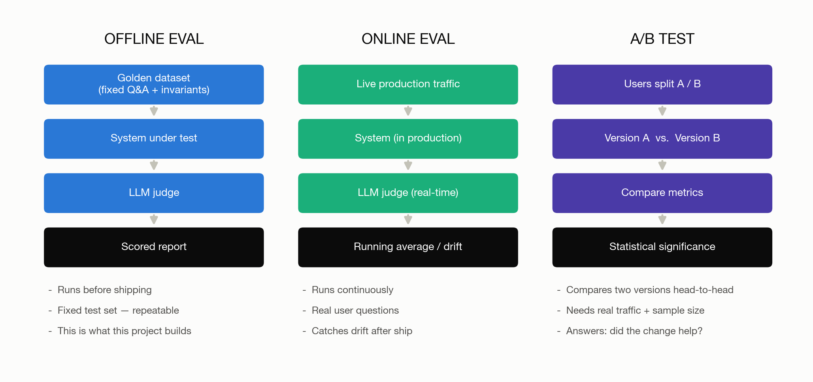
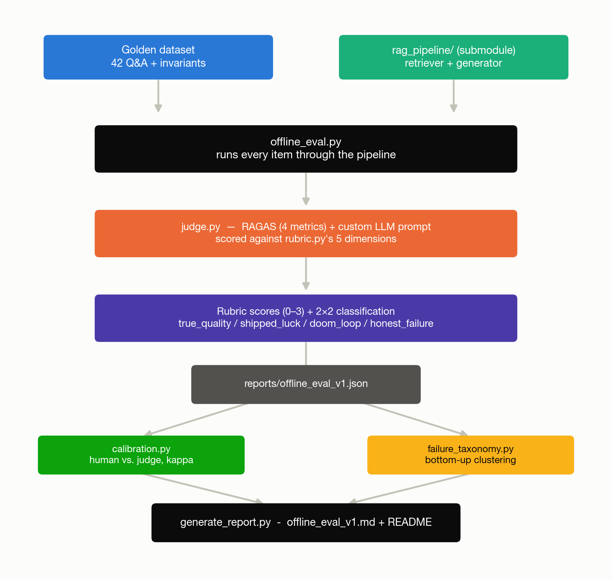
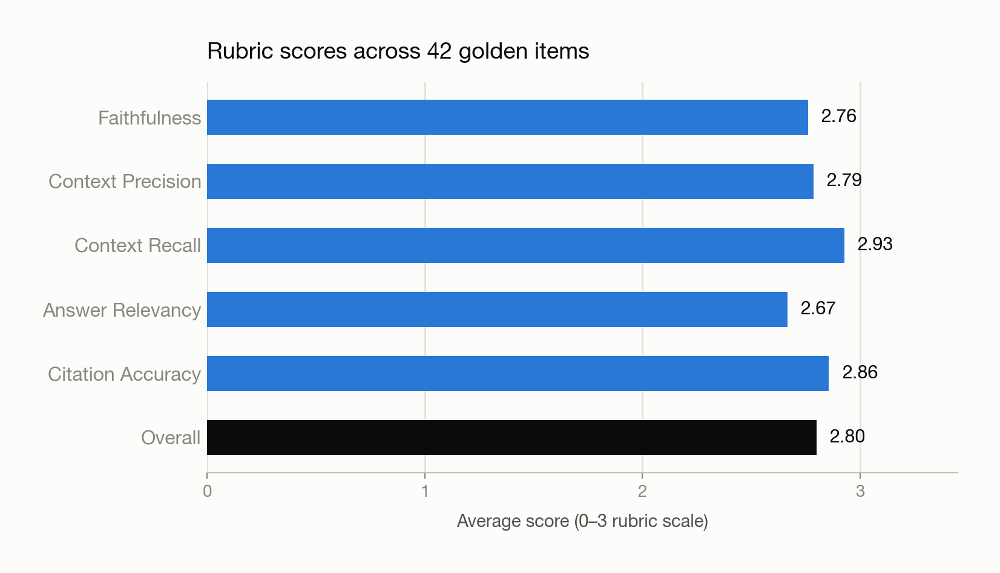
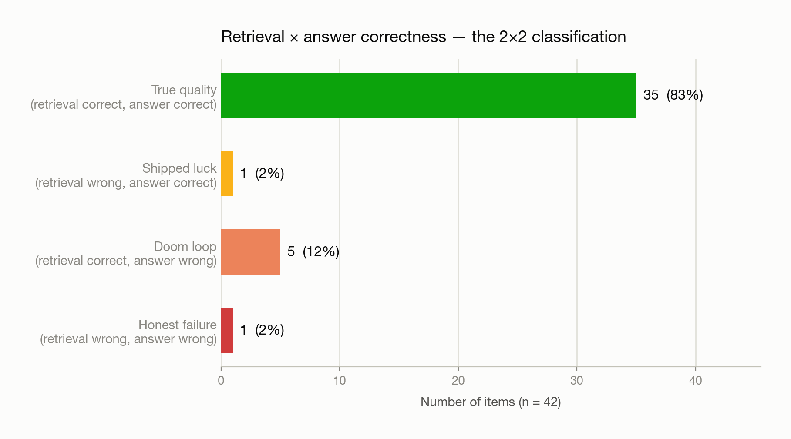
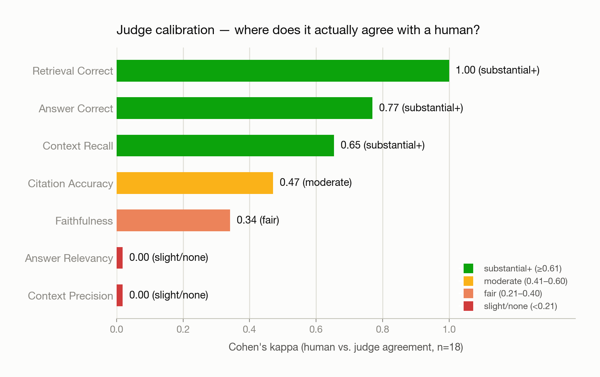
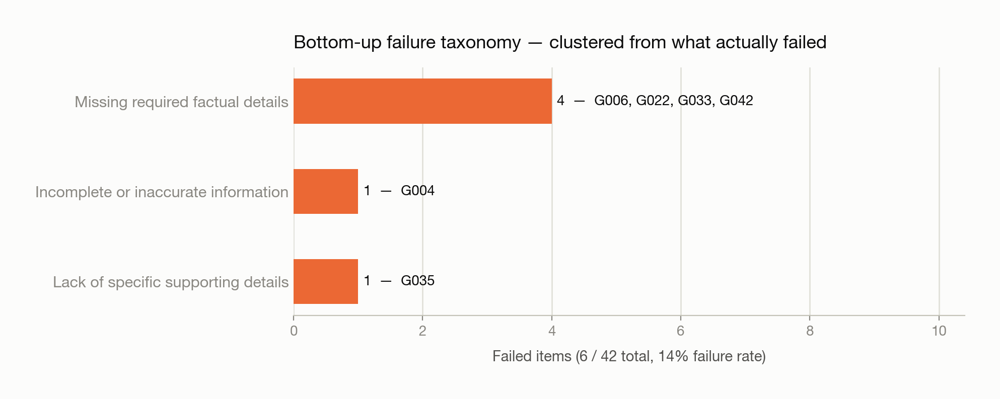

# Stop Eyeballing Your RAG Answers: A Practical Guide to Evals (With Real Numbers)

*How I built an evaluation framework for a RAG system — and what 42 golden questions, an LLM judge, and one stubborn calibration disagreement taught me about trusting AI-graded AI.*

---

## The problem this solves

I built a RAG system a while back — [RAG_LangChain_Demo](https://github.com/Charu1806/RAG_LangChain_Demo), a LangChain + ChromaDB + Mistral pipeline answering employee questions over a synthetic company knowledge base. It worked. I asked it a handful of questions, the answers looked right, I moved on.

That's the part nobody should be proud of. "I asked it a few things and it looked fine" isn't evaluation — it's vibes. It can't tell you *which* questions it gets wrong, *why*, or whether a change you made (a new embedding model, a retrieval tweak) actually helped or just moved the failures somewhere else you didn't happen to look.

So I built a second, standalone repo — [RAG_Eval_Framework](https://github.com/Charu1806/RAG_Eval_Framework) — whose only job is to measure the first one. This article walks through what "evals" actually means, what I built, and what the real results said, including the parts that didn't flatter the system.

---

## 1. What is an "eval," anyway?

"Eval" gets used loosely. In practice it splits into three distinct things, and conflating them is where most teams go wrong:

**Offline eval** runs a fixed, hand-built set of questions with known-correct facts through the system, before anything ships. It's repeatable — run it twice, get comparable numbers — because nothing about the test set changes between runs. This is what this project builds.

**Online eval** scores *real* production traffic as it happens, continuously. You don't control the questions; you're watching for drift — is quality holding up as real usage evolves? — rather than checking a fixed target.

**A/B testing** compares two live versions of the system against each other, on real users, with enough traffic to be statistically confident one is actually better rather than noise. It answers "did the change help," not "is the system good."

All three matter in a mature system. This project is deliberately, explicitly scoped to the first one.

---

## 2. What we're actually focusing on

The full plan (documented in the project's [PRD](https://github.com/Charu1806/RAG_Eval_Framework/blob/main/PRD.md)) has three parts: offline eval, online traffic simulation, and closing the loop with a real before/after fix. **This article covers Part 1 only** — the offline eval, built and run for real. Parts 2 and 3 are scoped but not built, and I'm saying that plainly rather than implying more than what exists.

Part 1's job, specifically:

- Build a **golden dataset**: real questions with *required facts* (not fixed answer strings — a correct answer can be phrased many ways), spanning every category in the knowledge base.
- Score every answer on **five separate rubric dimensions**, not one pass/fail verdict.
- Distinguish **"got the right answer for the wrong reason"** from **"got the right answer because retrieval actually worked"** — the single idea this whole framework is built around.
- **Calibrate the automated judge against my own independent judgment** before trusting its scores at scale.
- Build a **failure taxonomy from the bottom up** — let the actual failures define the categories, rather than guessing categories in advance.

---

## 3. The flow — what actually runs

Two things worth calling out in this flow:

**The RAG system under test is a git submodule, never modified or duplicated.** This eval framework imports its retriever and generator as a black box — same discipline as evaluating someone else's API. If you can freely edit the code under test to make your eval pass, your eval isn't measuring anything.

**Every score also gets a plain retrieval-correct / answer-correct boolean**, computed deterministically by checking whether the chunks the golden dataset says are needed actually got retrieved — not guessed by an LLM. Combined with whether the answer was actually correct, that gives four buckets:

| | Answer correct | Answer wrong |
|---|---|---|
| **Retrieval correct** | ✅ True quality | 🟠 Doom loop |
| **Retrieval wrong** | 🟡 Shipped luck | 🔴 Honest failure |

"Shipped luck" is the one that should worry you most in production: the answer happened to be right *despite* pulling the wrong context — nothing about *why* it worked will reproduce on the next question.

---

## 4. The five dimensions — and what each score actually means

A single 1–5 "quality" score hides more than it reveals. Every answer gets graded on five independent dimensions, each with its own concrete 0–3 definition (this is the actual rubric the judge is given — no vague "rate the quality" prompt):

| Dimension | What it asks | 0 | 3 |
|---|---|---|---|
| **Faithfulness** | Is every claim actually backed by the retrieved text? | Contradicts the context | Every claim is directly supported |
| **Context precision** | Of what got retrieved, how much was actually relevant? | None of it relevant | All (or nearly all) relevant |
| **Context recall** | Did retrieval pull *everything* the answer needed? | None of the required source material retrieved | All of it retrieved |
| **Answer relevancy** | Does the answer directly address the question asked? | Doesn't address it | Direct, complete, no padding |
| **Citation accuracy** | Are the cited sources the ones that actually support each claim? | No citations, or wrong ones | Every claim correctly attributed |

Four of these are scored by **RAGAS**, an open-source RAG eval library, which internally uses an LLM to judge each one. Citation accuracy and the retrieval/answer-correct booleans come from a custom prompt, since no off-the-shelf metric covers per-claim source attribution or "does this match the required facts" against our specific golden invariants.

Here's what those five dimensions actually scored, averaged across all 42 real questions:

---

## 5. Step by step — what we actually did, with real results

### Step 1 — Build the golden dataset

42 questions across all six knowledge-base categories (HR, Finance, Engineering, Support, Product, Employee), each with a list of *required facts* rather than one fixed answer string, plus which source chunk(s) contain the answer. Nine of them are "hard" — they need synthesis across two or more chunks, specifically to expose the cases where retrieval quietly drops half the answer.

### Step 2 — Run every question through the real pipeline, score it

Each question goes through the actual retriever and generator, then gets scored on all five dimensions plus the retrieval/answer-correct booleans. Real result, 42 items:

83% landed in the desired quadrant. The other 17% is where the interesting engineering questions live — and one item in particular is worth walking through in full, because it's simultaneously the system's most interesting failure *and* the calibration process's most interesting disagreement:

> **`G035`** — *"What user research finding motivated the AI Search feature's requirement for source citation, and which specific feature capability addresses it?"*
>
> The golden answer needs two source documents. Retrieval only found one. The judge scored this `honest_failure` (both retrieval and the answer wrong) — but the answer's content was still substantively correct, because the one document it *did* retrieve happened to reference the missing document's finding by name. Was that faithful reasoning or a lucky guess dressed up as one? Reasonable people can disagree — and in the calibration step below, we did.

### Step 3 — Calibrate the judge against a real human read

I hand-labeled 18 of the 42 items myself — blind to what the judge scored, specifically to avoid anchoring on its answers — then compared. This is the step most eval pipelines skip, and it's the one that actually tells you whether the numbers above are trustworthy:

The good news: the two booleans that actually drive the quadrant classification above — retrieval-correct and answer-correct — showed strong-to-perfect agreement with my own read. The classification you're trusting most is the one that held up best.

The finding worth not burying: **`context_precision` and `answer_relevancy` both came back at 0.00 agreement.** Digging into the actual per-item gaps (not just the summary kappa number) showed why: on every single flagged disagreement, I'd scored context precision a strict `1` (most retrieved chunks were off-topic — one password-reset question, for instance, also pulled in a billing troubleshooting doc and a mobile-app guide), while the judge scored the same chunks a lenient `3`. That's not noise — it's a consistent, one-directional bias. The automated judge is measurably more generous about "relevance" than a strict human read. Worth knowing before you trust that number unattended.

### Step 4 — Cluster the failures, bottom-up

No predefined failure categories — the 6 failed items get clustered by what they actually have in common (via TF-IDF similarity over the question + the judge's own reasoning text — plain semantic embeddings were tried first and empirically performed worse at this scale, so TF-IDF won on evidence, not by default), and only afterward does an LLM name each cluster:

Two-thirds of all failures in this run reduce to one root cause: **the retrieved context had the answer, and the model still left part of it out.** Not a retrieval problem — a generation-discipline problem. That's exactly the kind of specific, actionable finding "the answers seemed fine" could never have produced.

### Step 5 — Generate the report

One command pulls the JSON from every stage above into a single markdown report and updates this repo's README, so the numbers live next to the code that produced them — not in a slide deck that goes stale the moment someone re-runs the pipeline.

---

## 6. Final takeaway

Three things I'd tell someone starting this from scratch:

**A single quality score is a rounding error away from useless.** "2.80 out of 3" tells you almost nothing on its own. *Faithfulness fine, citation accuracy fine, but two-thirds of all failures are the model dropping a fact it already had in front of it* — that's a finding you can actually act on, and it only exists because the rubric was five numbers, not one.

**Calibrate before you trust — and calibrate more than the headline number.** The kappa summary alone would have told me "the judge and I mostly disagree on precision and relevancy." Looking at the actual per-item gaps told me something more useful and more specific: the judge is systematically lenient on one dimension, in one consistent direction, in a way I can now name and correct for. A kappa score without the disagreement detail behind it is just a smaller vibe.

**The system that scores your system needs its own eval.** It's tempting to treat the judge as ground truth once it's wired up. It isn't. It's a second model, with its own blind spots, and the only way to know where those blind spots are is to put a real independent human judgment next to it and look — closely — at exactly where the two disagree, not just by how much.

Everything here — the golden dataset, the rubric, the judge, the calibration workflow, the failure clustering, and the real results shown above — is in the open-source repo: [RAG_Eval_Framework](https://github.com/Charu1806/RAG_Eval_Framework). Parts 2 (online traffic simulation) and 3 (closing the loop with a real fix) are scoped in the PRD and are next.
